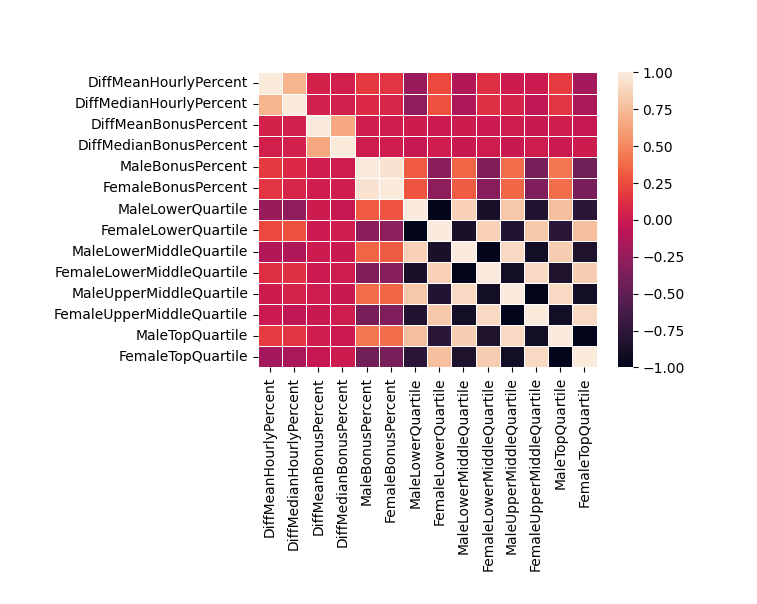

# Data Preparation and Understanding

***This markdown file is used to describe the process of data preparation including how missing values are dealt with 
and how region, industry and size of the company are determined. It will also provide some data visualizations to help 
understand the dataset.***

## 1. Description of Initial Data from GOV.UK
The dataset shows the gender pay gap situations reported from different companies in various sizes and 
from different industries and regions. It consists of six separate csv spreadsheets, which show situations from reporting
year 2017-18 to 2022-23 respectively. It can be downloaded from [website of Gender Pay Gap Service of UK Government.](https://gender-pay-gap.service.gov.uk)
Each spreadsheet has the same 27 columns which can ba grouped into
three categories:

| Company Basic Info                                                                                                                       | Gender Pay Gap Figures                                                                                                                                                                                                                                                                                                 | Submission Time                                   |
|------------------------------------------------------------------------------------------------------------------------------------------|------------------------------------------------------------------------------------------------------------------------------------------------------------------------------------------------------------------------------------------------------------------------------------------------------------------------|---------------------------------------------------|
| EmployerName, EmployerID, Address, PostCode, CompanyNumber, SicCodes, CompanyLinkToGPGInfo, ResponsiblePerson, EmployerSize, CurrentName | DiffMeanHourlyPercent, DiffMedianHourlyPercent, DiffMeanBonusPercent, DiffMedianBonusPercent, MaleBonusPercent, FemaleBonusPercent, MaleLowerQuartile, FemaleLowerQuartile, MaleLowerMiddleQuartile, FemaleLowerMiddleQuartile, MaleUpperMiddleQuartile, FemaleUpperMiddleQuartile, MaleTopQuartile, FemaleTopQuartile | SubmittedAfterTheDeadline, DueDate, DateSubmitted |
                                                                                                                                                                                                                                                                                                                                                                                                            
In case of data types, the 27 columns can also be grouped into three:

| Text                                                                                                                         | Numerical                                                                                                                                                                                                                                                                                                                          | Boolean                   |
|------------------------------------------------------------------------------------------------------------------------------|------------------------------------------------------------------------------------------------------------------------------------------------------------------------------------------------------------------------------------------------------------------------------------------------------------------------------------|---------------------------|
| EmployerName, Address, PostCode, CompanyNumber, SicCodes, CompanyLinkToGPGInfo, ResponsiblePerson, EmployerSize, CurrentName | EmployerId, DiffMeanHourlyPercent, DiffMedianHourlyPercent, DiffMeanBonusPercent, DiffMedianBonusPercent, MaleBonusPercent, FemaleBonusPercent, MaleLowerQuartile, FemaleLowerQuartile, MaleLowerMiddleQuartile, FemaleLowerMiddleQuartile, MaleUpperMiddleQuartile, FemaleUpperMiddleQuartile, MaleTopQuartile, FemaleTopQuartile | SubmittedAfterTheDeadline |

The number of rows of each table is shown below:

| Reporting Year | Rows      |
|----------------|-----------|
| 2017-18        | 10225     |
| 2018-19        | 10466     |
| 2019-20        | 6921      |
| 2020-21        | 10532     |
| 2021-22        | 10491     |
| 2022-23        | 353       |
|                |           |
| **Total**      | **48988** |

The exact meaning of each column can be checked from the original website. 
In case readers of this file do not have time to check on their own and some names are not quite intuitive, 
it is necessary to explain some vague meanings:

1. **SicCodes** represents Standard Industrial Classification code of the company at the time of submission, showing its nature of business;
2. All **Diff** values show the % difference between male and female, where the negative figures indicate female has higher pay;
3. The remaining **Gender Pay Gap Figures** represent the percentage of certain gender employee paid a bonus or in certain quarter of payment levels within their company.

## 2. Data Preparation
After loading the six spreadsheets into the data_prep python file and looking at their basic information mentioned in 
the previous section, we decided to merge all the tables into one single dataframe they all contain the same columns. 
The merger is inconsequential as we do not expect the situation would vary a lot within these years, and we do not plan 
to analyze in time series. Instead, we wish to have a look at the gender pay gap situation across different industries, 
regions and company sizes. The merged dataset then became the initial dataset for preparation.

<details><summary> CLICK TO SEE CODES TO LOAD & MERGE DATASET </summary>
<p>

```ruby
# Load initial datasets
df_1 = pd.read_csv('Gender_Pay_Gap/UK Gender Pay Gap Data - 2017 to 2018.csv')
df_2 = pd.read_csv('Gender_Pay_Gap/UK Gender Pay Gap Data - 2018 to 2019.csv')
df_3 = pd.read_csv('Gender_Pay_Gap/UK Gender Pay Gap Data - 2019 to 2020.csv')
df_4 = pd.read_csv('Gender_Pay_Gap/UK Gender Pay Gap Data - 2020 to 2021.csv')
df_5 = pd.read_csv('Gender_Pay_Gap/UK Gender Pay Gap Data - 2021 to 2022-2.csv')
df_6 = pd.read_csv('Gender_Pay_Gap/UK Gender Pay Gap Data - 2022 to 2023-3.csv')
dfs = [df_1, df_2, df_3, df_4, df_5, df_6]
for df in dfs:
    print(df.shape, df.columns, df.dtypes)
# Merge datasets into a single large one and save
df_merge = pd.concat([df_1, df_2, df_3, df_4, df_5, df_6], axis=0)
print(df_merge.shape, df_merge.columns)
df_merge.to_csv('gender_pay_gap_initial.csv')
```
   
</p>
</details>

### 2.1. Delete Unnecessary Columns
Since the time series are no loger considered, columns including 
**SubmittedAfterTheDeadline, DueDate & DateSubmitted** can be removed. Meanwhile, in order to protect privacy and 
prevent direct focus on a particular company, information including **Address, EmployerName, EmployerId, 
CompanyNumber, CompanyLinkToGPGInfo,ResponsiblePerson & CurrentName** that can locate a specific company or person 
are removed as well. Although **PostCode** can also indicate the address of that single company, it is kept at this stage 
and will be processed later as the project needs to analyze on regional patterns. 

<details><summary> CLICK TO SEE CODES TO DELETE UNNECESSARY COLUMNS </summary>
<p>

```ruby
df_merge.drop(['Address', 'EmployerName', 'EmployerId', 'CompanyNumber', 'CompanyLinkToGPGInfo',
               'ResponsiblePerson', 'CurrentName', 'SubmittedAfterTheDeadline',
               'DueDate', 'DateSubmitted'], axis=1, inplace=True)
print(df_merge.shape, df_merge.columns)
```

</p>
</details>

### 2.2. Deal with Null Values
By using the code

```print(df_merge.isnull().sum())```

The numbers of null values for each column are shown as below:

```
PostCode                      170
SicCodes                     2919
DiffMeanHourlyPercent           0
DiffMedianHourlyPercent         0
DiffMeanBonusPercent         9015
DiffMedianBonusPercent       9017
MaleBonusPercent                0
FemaleBonusPercent              0
MaleLowerQuartile             397
FemaleLowerQuartile           397
MaleLowerMiddleQuartile       397
FemaleLowerMiddleQuartile     397
MaleUpperMiddleQuartile       397
FemaleUpperMiddleQuartile     397
MaleTopQuartile               397
FemaleTopQuartile             397
EmployerSize                    0
dtype: int64

```

#### Delete Directly

It can be inferred that missing values on **MaleLowerQuartile, FemaleLowerQuartile, 
MaleLowerMiddleQuartile, FemaleLowerMiddleQuartile, MaleUpperMiddleQuartile, FemaleUpperMiddleQuartile, 
MaleTopQuartile and FemaleTopQuartile** are in the **same rows**. Meanwhile, compared with 48988 total rows, 
these 397 rows as well as 2919 rows containing missing values on SicCodes and 
only 170 of that on PostCode seem to be irrelevant. 
Therefore, these columns are simply removed from the dataset with the code

```df_merge = df_merge.dropna(subset=['MaleLowerQuartile', 'SicCodes', 'PostCode'])```

#### Perform Random Forest Model to Predict Missing Values

However, even after deleting these rows, there are still 8181 missing values on DiffMeanBonusPercent and 
8183 on DiffMedianBonusPercent, which are relatively a large proportion (approximately 18%) 
of the total rows. This proportion makes it unsuitable to be removed as above as it may affect the
 total trend. Furthermore, by looking at the correlation heatmap below, there is no obvious correlations between those two 
variables and others. Therefore, it is not possible to infer those missing values directly from existing values.



<details><summary> CLICK TO SEE CODES TO DRAW CORRELATION HEATMAP </summary>
<p>

```ruby

pd.set_option('display.max_columns', None)
print(df_merge.corr())
ax = sns.heatmap(df_merge.corr(), linewidth=0.5)
plt.show()

```
   
</p>
</details>

In this case, a tree-based machine learning model -- Random Forest is utilized to predict those missing 
values. To perform the model, the dataframe was first split into a training dataframe with no missing values and a 
testing dataframe with rows containing those missing values. Each dataframe was also separated to two dependent 
variable dataframe containing columns of DiffMeanBonusPercent & DiffMedianBonusPercent respectively, which the model is about to 
make predictions on, and an independent variable dataframe containing other numerical values. Then, the training 
data was fitted into the Random Forest model to train the model. After training the model, the testing dataset was 
used to make predictions on those missing values and those missing values were filled with predictions.

***Very Important Message to Readers: The Random Forest Model can be quite slow to 
execute :smiling_face_with_tear:, please be patient.***

***Also, there might be an error message showing***
```
DataConversionWarning: A column-vector y was passed when a 1d array was expected. Please change the shape of y to (n_samples,), for example using ravel().
  model_1.fit(X_train, y_1_train)
```
***This can be ignored as it will not impact the result.***

<details><summary> CLICK TO SEE CODES TO PERFORM RANDOM FOREST & FILL IN MISSING VALUES </summary>
<p>

```ruby

# Split Dataset
X_train = df_merge_training[['DiffMeanHourlyPercent',
                             'DiffMedianHourlyPercent', 'MaleBonusPercent', 'FemaleBonusPercent',
                             'MaleLowerQuartile', 'FemaleLowerQuartile', 'MaleLowerMiddleQuartile',
                             'FemaleLowerMiddleQuartile', 'MaleUpperMiddleQuartile',
                             'FemaleUpperMiddleQuartile', 'MaleTopQuartile', 'FemaleTopQuartile']]

y_1_train = df_merge_training[['DiffMeanBonusPercent']]

y_2_train = df_merge_training[['DiffMedianBonusPercent']]

X_test = df_merge_testing[['DiffMeanHourlyPercent',
                           'DiffMedianHourlyPercent', 'MaleBonusPercent', 'FemaleBonusPercent',
                           'MaleLowerQuartile', 'FemaleLowerQuartile', 'MaleLowerMiddleQuartile',
                           'FemaleLowerMiddleQuartile', 'MaleUpperMiddleQuartile',
                           'FemaleUpperMiddleQuartile', 'MaleTopQuartile', 'FemaleTopQuartile']]

# Define Model

model_1 = RandomForestRegressor(n_estimators=100, random_state=0)

model_2 = RandomForestRegressor(n_estimators=100, random_state=0)

# Fit Model

model_1.fit(X_train, y_1_train)

model_2.fit(X_train, y_2_train)

# Predict the value with the testing data and substitute values to null values
y_1_pred = model_1.predict(X_test)
y_2_pred = model_2.predict(X_test)
print(y_1_pred, y_2_pred)
df_merge_testing = df_merge_testing.assign(DiffMeanBonusPercent=y_1_pred)
df_merge_testing = df_merge_testing.assign(DiffMedianBonusPercent=y_2_pred)
print(df_merge_testing.shape, df_merge_testing.columns, df_merge_testing.isnull().sum())

```
   
</p>
</details>

#### Bind Separated Dataframes

Finally, the testing dataframe filled with predicted values was integrated with the training dataframe, which 
generated a dataframe with 45650 rows and no missing values. 

```

(45650, 17) 

Index(['PostCode', 'SicCodes', 'DiffMeanHourlyPercent',
       'DiffMedianHourlyPercent', 'DiffMeanBonusPercent',
       'DiffMedianBonusPercent', 'MaleBonusPercent', 'FemaleBonusPercent',
       'MaleLowerQuartile', 'FemaleLowerQuartile', 'MaleLowerMiddleQuartile',
       'FemaleLowerMiddleQuartile', 'MaleUpperMiddleQuartile',
       'FemaleUpperMiddleQuartile', 'MaleTopQuartile', 'FemaleTopQuartile',
       'EmployerSize'],
      dtype='object') 

PostCode                     0
SicCodes                     0
DiffMeanHourlyPercent        0
DiffMedianHourlyPercent      0
DiffMeanBonusPercent         0
DiffMedianBonusPercent       0
MaleBonusPercent             0
FemaleBonusPercent           0
MaleLowerQuartile            0
FemaleLowerQuartile          0
MaleLowerMiddleQuartile      0
FemaleLowerMiddleQuartile    0
MaleUpperMiddleQuartile      0
FemaleUpperMiddleQuartile    0
MaleTopQuartile              0
FemaleTopQuartile            0
EmployerSize                 0

```

<details><summary> CLICK TO SEE CODES TO INTEGRATE TWO DATAFRAMES </summary>
<p>

```ruby

df_none_na = pd.concat([df_merge_training, df_merge_testing], axis=0)
print(df_none_na.shape, df_none_na.columns, df_none_na.isnull().sum(), df_none_na.head(5))

```

</p>
</details>

### 2.3. Deal with PostCode, SicCodes & EmployerSize
The current dataset has no clear indication on the region and industry of those companies. Therefore, we need to 
infer these information from PostCode and SicCodes. Meanwhile, in case future analysis may need relations between 
those index with company sizes, it is better to convert the EmployerSize into a numerical variable.

#### Deal with PostCode
As mentioned above, it is not appropriate to include information that can target on a particular company. Since the 
postcode in UK can easily locate an address, which then can locate the company, it is necessary to substitute these 
postcodes with a wider geographical area. By looking at the [explanation on UK postcode format 
published by UK Government, ](https://assets.publishing.service.gov.uk/government/uploads/system/uploads/attachment_data/file/283357/ILRSpecification2013_14Appendix_C_Dec2012_v1.pdf)
it can be concluded that a postcode in UK consists of two parts -- an Outcode (before space) and an Incode (after space). 
Having only the Outcode can locate the region of the company in. Therefore, strings after the space in the column 
PostCode were dropped and only the Outcode part was kept with code below.

```ruby

df_none_na["PostCode"] = df_none_na["PostCode"].str.split().str[0]

```
Then, [a dataset published by doogal.co.uk](https://www.doogal.co.uk/PostcodeDistricts) with a complete list of UK 
postcode districts was used to match the Outcode to the Region and UK Region it represent with inner merge function of pandas.

```ruby

df_out_code = pd.read_csv('Postcode districts.csv')
df_out_code.drop(['Latitude', 'Longitude', 'Easting', 'Northing', 'Grid Reference', 'Town/Area',
                  'Postcodes', 'Active postcodes', 'Population', 'Households',
                  'Nearby districts'], axis=1, inplace=True)
print(df_out_code.dtypes)

# Inner merge two df
df_none_na = df_none_na.merge(df_out_code, left_on='PostCode', right_on='Postcode', how='inner')
print(df_none_na.shape, df_none_na.columns, df_none_na.isnull().sum(), df_none_na.head(5))
df_none_na.drop(['Postcode'], axis=1, inplace=True)
print(df_none_na.shape, df_none_na.columns, df_none_na.isnull().sum(), df_none_na.head(5))

```

#### Deal with SicCodes


